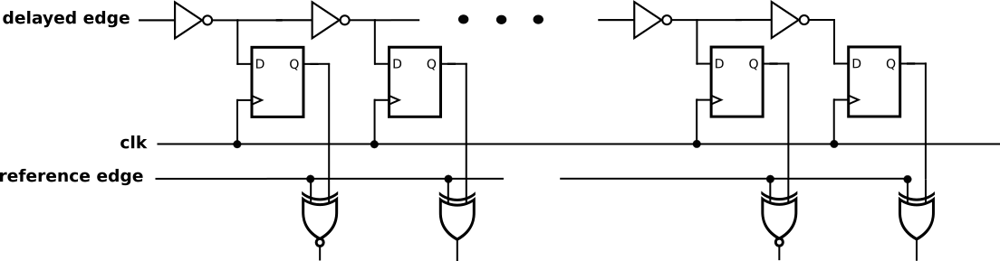

# Digital_Path_Timing_Monitor

This branch contains a generic edge detector.

It transforms the delay between two signals into a digital signal.

The delay is represented as a thermal code or a ones counter 

